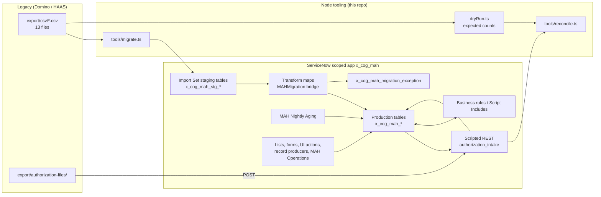
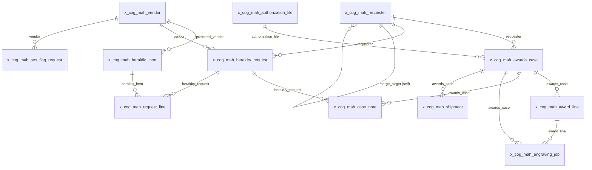

# MAH Case Management (`x_cog_mah`)

ServiceNow scoped application for the U.S. Army TACOM ILSC **Medals, Awards & Heraldry (MAH)** mission,
authored entirely with the official [ServiceNow SDK](https://servicenow.github.io/sdk/) and its Fluent
TypeScript metadata-as-code API. It is the **target side of a legacy modernization reference
application**: it replaces both the front end (XPages, views, action buttons) and the back end
(LotusScript / @Formula agents, Readers fields, DXL export) of a synthetic HCL Domino application
("HAAS") whose export lives in the sibling repository `COG-GTM-haas-domino-legacy`.

> All data in this repository and in the sibling export is **synthetic**. Names, service numbers,
> addresses, document numbers and vendors are fictitious. No production DoD data is present.

## What is in the box

| Area | Contents |
| --- | --- |
| Data model | One Fluent table per legacy form plus status map and migration exceptions (`src/fluent/tables/`), auto-numbers, choices, references, journals, full audit |
| Server logic | Business rules → pure TypeScript modules (`src/server/rules/`, `src/server/lib/`), Script Includes, scheduled nightly aging, event-driven notifications |
| Integration | Scripted REST API `/api/x_cog_mah/authorization_intake` (HRC / NPRC authorization file intake, status lookup, reconciliation, migration finalize) |
| Security | 8 roles mirroring the Domino ACL, generated table + field ACLs, vendor isolation query rules, JSON security logging, whitelist validation everywhere |
| Operator UI | Application menu and modules, dense lists / forms / related lists for every table, UI actions, DD 1348-6 client scripts, record producers, reports, dashboard and the **MAH Operations** workspace |
| Migration | One Import Set staging table + data source + transform map per legacy CSV, status map, requester dedupe, orphan quarantine, `tools/migrate.ts`, `tools/reconcile.ts` |
| Quality | Strict TypeScript, ESLint, Vitest suites for every pure module, bidirectional sync tests for every generated artefact, `now-sdk build` |

## Architecture



Every piece of behaviour lives in a pure TypeScript module under `src/server/` that Vitest exercises
directly; the Fluent files under `src/fluent/` only declare metadata and point at those modules. Metadata
that would otherwise be hand-copied (lists, forms, ACLs, staging tables, transform maps, reports,
workspace, this README's tables) is **generated** from a single registry and guarded by sync tests:

| Generator | Source of truth | Output |
| --- | --- | --- |
| `npm run gen:ui` | `src/server/lib/uiLayout.ts` | `src/fluent/ui/lists.now.ts`, `forms.now.ts`, `related_lists.now.ts` |
| `npm run gen:security` | `src/server/lib/security.ts` | `src/fluent/security/acls.now.ts` |
| `npm run gen:migration` | `src/server/lib/legacyContract.ts`, `statusMap.ts`, `migration/rowTransforms.ts` | `src/fluent/migration/*.now.ts` |
| `npm run gen:operations` | `tools/lib/operations-catalog.ts` | `src/fluent/reports/`, `src/fluent/sla/`, `src/fluent/workspace/`, `src/fluent/ui/operations_modules.now.ts` |
| `npm run gen:docs` | domain registries + `tools/lib/docs-catalog.ts` | generated blocks in this README and `docs/*.md` |

## Data model

<!-- gen:tables -->
| Table | Prefix | Legacy form(s) | Status field | Columns | Replaces legacy view(s) |
| --- | --- | --- | --- | --- | --- |
| `x_cog_mah_awards_case` | `MAH` | vetmedals-AwardsCase | `stage` | 56 | Cases\By Stage, Cases\Aging, Cases\By Requester, Cases\All |
| `x_cog_mah_award_line` | `MAL` | vetmedals-AwardLine | `status` | 27 | Lines\By Case, Lines\Engraving Queue |
| `x_cog_mah_requester` | `MAR` | vetmedals-Requester, heraldry-Requester | `state` | 41 | Requesters\By Name, Requesters\Duplicates |
| `x_cog_mah_authorization_file` | `MAF` | vetmedals-AuthorizationFile | `parse_status` | 34 | Intake\Authorization Files |
| `x_cog_mah_engraving_job` | `MEJ` | vetmedals-EngravingJob | `status` | 28 | Engraving\Queue, Engraving\By Engraver |
| `x_cog_mah_shipment` | `MSH` | vetmedals-ShipmentRecord | `status` | 27 | Warehouse\Shipments |
| `x_cog_mah_case_note` | `MCN` | vetmedals-CaseNote | `state` | 25 | Notes\By Case |
| `x_cog_mah_heraldry_request` | `HRQ` | heraldry-Request | `state` | 47 | Requests\By State, Requests\By Vendor, Requests\Released, Requests\All |
| `x_cog_mah_request_line` | `HRL` | heraldry-RequestLine | `status` | 25 | Lines\By Request |
| `x_cog_mah_heraldic_item` | `HIT` | heraldry-HeraldicItem | `state` | 27 | Catalog\Heraldic Items, Catalog\By Category |
| `x_cog_mah_ses_flag_request` | `SES` | heraldry-SESFlagRequest | `state` | 32 | SES\Pending, SES\All |
| `x_cog_mah_vendor` | `VND` | heraldry-Vendor | `state` | 25 | Vendors\Active |
| `x_cog_mah_status_map` | `MSM` | — | `state` | 17 | — |
| `x_cog_mah_migration_exception` | `MMX` | — | `state` | 25 | — |
<!-- /gen:tables -->

Every table carries the shared legacy identity fields `number`, `legacy_unid` (unique, indexed Domino
UNID), `legacy_form`, `legacy_status_raw` (the free-text Domino status verbatim), `legacy_last_modified`,
`state` and `active`, and is audited (`sys_audit`).

### Relationships

<!-- gen:erd -->

<!-- /gen:erd -->

References to platform tables:

<!-- gen:platform-refs -->
| Table | Column | Platform table |
| --- | --- | --- |
| `x_cog_mah_authorization_file` | `submitted_by` | `sys_user` |
| `x_cog_mah_awards_case` | `assigned_to` | `sys_user` |
| `x_cog_mah_awards_case` | `assignment_group` | `sys_user_group` |
| `x_cog_mah_case_note` | `author` | `sys_user` |
| `x_cog_mah_engraving_job` | `engraver` | `sys_user` |
| `x_cog_mah_heraldry_request` | `released_by` | `sys_user` |
| `x_cog_mah_heraldry_request` | `submitted_by` | `sys_user` |
| `x_cog_mah_heraldry_request` | `reviewer` | `sys_user` |
| `x_cog_mah_migration_exception` | `resolved_by` | `sys_user` |
| `x_cog_mah_ses_flag_request` | `approved_by` | `sys_user` |
| `x_cog_mah_shipment` | `shipped_by` | `sys_user` |
| `x_cog_mah_vendor` | `portal_user` | `sys_user` |
| `x_cog_mah_vendor` | `user_group` | `sys_user_group` |
<!-- /gen:platform-refs -->

### Lifecycle

<!-- gen:lifecycle -->
- Awards case stages: Authorized → Engraving → Assembly/QC → Warehouse → Shipped → Closed (plus Cancelled, Unmapped).
- Heraldry request states: Draft → Submitted → In Review → Released to Vendor → In Production → Shipped → Complete (plus Cancelled, Unmapped).
- Aging: amber at 60 days in stage, red at 75; recomputed by the `MAH Nightly Aging` scheduled job.
- Events: `x_cog_mah.case.stage_changed`, `x_cog_mah.case.aging_red`, `x_cog_mah.request.submitted`, `x_cog_mah.request.released`, `x_cog_mah.ses.submitted`.
<!-- /gen:lifecycle -->

The 60 / 75-day awards target is also declared as two SLA definitions; see [docs/SLA.md](docs/SLA.md)
for why the platform SLA engine does not evaluate them on a standalone (non-`task`) table and how the
aging job covers the gap.

## Domino → ServiceNow mapping

<!-- gen:mapping -->
| Domino design element | ServiceNow artefact | Where |
| --- | --- | --- |
| Database (vetmedals.nsf, heraldry.nsf) | Scoped application `x_cog_mah` | now.config.json, src/fluent/ |
| Form | Table (`Table` / `*Column`) with choices, references, audit | src/fluent/tables/*.now.ts |
| View | List layout, report, workspace list | src/fluent/ui/lists.now.ts, src/fluent/reports/ |
| Computed item / @Formula | Before business rule calling a pure TypeScript module | src/fluent/rules/business_rules.now.ts, src/server/rules/ |
| QuerySave / PostSave agent | Before / after business rule | src/server/rules/*.ts |
| Scheduled LotusScript agent | Scheduled script (`ScheduledScript`) | src/fluent/jobs/nightly_aging.now.ts |
| Web-service / file-drop agent | Scripted REST API | src/fluent/rest/authorization_intake.now.ts |
| Mail agent (SendStatusMail) | Event registry + notifications | src/fluent/notifications/ |
| ACL roles | Roles + table / field ACLs | src/fluent/security/ |
| Readers / Authors fields | Query business rules (vendor isolation) | src/server/rules/vendorIsolation.ts |
| Action buttons | UI actions | src/fluent/ui/ui_actions.now.ts |
| Form events / hide-when formulas | Client scripts / UI policies | src/fluent/ui/client_scripts.now.ts |
| XPages | Record producers (Service Portal) + native workspace | src/fluent/catalog/, src/fluent/workspace/ |
| DXL / CSV export | Import Set staging tables, data sources, transform maps | src/fluent/migration/ |
| Domino log.nsf | Structured JSON `gs.info` events | src/server/lib/logging.ts |
<!-- /gen:mapping -->

The full behaviour-by-behaviour mapping, including the test that proves each one, is in
[docs/EQUIVALENCE-MATRIX.md](docs/EQUIVALENCE-MATRIX.md).

## Roles and access

<!-- gen:roles -->
| Legacy ACL role | ServiceNow role | Read | Write |
| --- | --- | --- | --- |
| `[TACOM]` | `x_cog_mah.tacom_staff` | 14 tables | 12 tables |
| `[CSR]` | `x_cog_mah.csr` | 12 tables | 7 tables |
| `[Engraver]` | `x_cog_mah.engraver` | 5 tables | 3 tables |
| `[Assembler]` | `x_cog_mah.assembler` | 5 tables | 3 tables |
| `[Warehouse]` | `x_cog_mah.warehouse` | 5 tables | 3 tables |
| `[Vendor]` | `x_cog_mah.vendor` | 5 tables | 2 tables |
| `[DLA]` | `x_cog_mah.dla` | 10 tables | 4 tables |
| `[Admin]` | `x_cog_mah.admin` | 14 tables | 14 tables |
<!-- /gen:roles -->

Table-level access matrix (generated into `src/fluent/security/acls.now.ts`):

<!-- gen:access-matrix -->
| Table | read | create | write | delete |
| --- | --- | --- | --- | --- |
| `x_cog_mah_awards_case` | tacom_staff, csr, engraver, assembler, warehouse, dla, admin | tacom_staff, csr, admin | tacom_staff, csr, engraver, assembler, warehouse, admin | admin |
| `x_cog_mah_award_line` | tacom_staff, csr, engraver, assembler, warehouse, dla, admin | tacom_staff, csr, admin | tacom_staff, csr, engraver, assembler, warehouse, admin | admin |
| `x_cog_mah_requester` | tacom_staff, csr, dla, admin | tacom_staff, csr, admin | tacom_staff, csr, admin | admin |
| `x_cog_mah_authorization_file` | tacom_staff, csr, dla, admin | tacom_staff, csr, admin | tacom_staff, csr, admin | admin |
| `x_cog_mah_engraving_job` | tacom_staff, csr, engraver, assembler, admin | tacom_staff, engraver, admin | tacom_staff, engraver, assembler, admin | admin |
| `x_cog_mah_shipment` | tacom_staff, csr, warehouse, dla, admin | tacom_staff, warehouse, admin | tacom_staff, warehouse, admin | admin |
| `x_cog_mah_case_note` | tacom_staff, csr, engraver, assembler, warehouse, dla, admin, vendor | tacom_staff, csr, engraver, assembler, warehouse, dla, admin, vendor | admin | admin |
| `x_cog_mah_heraldry_request` | tacom_staff, csr, dla, vendor, admin | tacom_staff, csr, dla, admin | tacom_staff, csr, dla, vendor, admin | admin |
| `x_cog_mah_request_line` | tacom_staff, csr, dla, vendor, admin | tacom_staff, csr, dla, admin | tacom_staff, csr, dla, vendor, admin | admin |
| `x_cog_mah_heraldic_item` | tacom_staff, csr, engraver, assembler, warehouse, dla, admin, vendor | tacom_staff, dla, admin | tacom_staff, dla, admin | admin |
| `x_cog_mah_ses_flag_request` | tacom_staff, csr, admin | tacom_staff, csr, admin | tacom_staff, csr, admin | admin |
| `x_cog_mah_vendor` | tacom_staff, csr, dla, vendor, admin | tacom_staff, dla, admin | tacom_staff, dla, admin | admin |
| `x_cog_mah_status_map` | tacom_staff, admin | admin | admin | admin |
| `x_cog_mah_migration_exception` | tacom_staff, admin | admin | tacom_staff, admin | admin |
<!-- /gen:access-matrix -->

Field-level restrictions:

<!-- gen:field-access -->
| Table | Field | Operation | Roles | Why |
| --- | --- | --- | --- | --- |
| `x_cog_mah_requester` | `dob` | read | tacom_staff, csr, admin | PII: date of birth visible to case owners only |
| `x_cog_mah_requester` | `service_number_last4` | read | tacom_staff, csr, admin | PII: partial service number visible to case owners only |
| `x_cog_mah_requester` | `merged_into` | write | tacom_staff, admin | Merging requesters is a supervised data-quality action |
| `x_cog_mah_awards_case` | `legacy_unid` | write | admin | Legacy identity is immutable after migration |
| `x_cog_mah_awards_case` | `legacy_status_raw` | write | admin | Legacy identity is immutable after migration |
| `x_cog_mah_heraldry_request` | `legacy_unid` | write | admin | Legacy identity is immutable after migration |
| `x_cog_mah_heraldry_request` | `released_to_vendor` | write | tacom_staff, dla, admin | Vendor release is a DLA / TACOM decision |
| `x_cog_mah_heraldry_request` | `vendor` | write | tacom_staff, dla, admin | Vendor assignment is a DLA / TACOM decision |
| `x_cog_mah_heraldry_request` | `fund_code` | write | tacom_staff, csr, dla, admin | Vendors may not alter funding data |
| `x_cog_mah_heraldry_request` | `project_code` | write | tacom_staff, csr, dla, admin | Vendors may not alter funding data |
| `x_cog_mah_heraldry_request` | `document_number` | write | tacom_staff, csr, dla, admin | Vendors may not alter the DD 1348-6 header |
| `x_cog_mah_heraldry_request` | `justification` | write | tacom_staff, csr, dla, admin | Vendors may not alter the DD 1348-6 header |
| `x_cog_mah_heraldry_request` | `work_notes` | read | tacom_staff, csr, dla, admin | Internal work notes are not vendor-visible |
| `x_cog_mah_heraldry_request` | `work_notes` | write | tacom_staff, csr, dla, admin | Internal work notes are not vendor-visible |
| `x_cog_mah_request_line` | `unit_price` | write | tacom_staff, dla, admin | Vendors may not reprice lines |
| `x_cog_mah_request_line` | `quantity` | write | tacom_staff, csr, dla, admin | Vendors may not change ordered quantity |
| `x_cog_mah_vendor` | `portal_user` | write | admin | Vendor login mapping is an administrative security setting |
| `x_cog_mah_vendor` | `user_group` | write | admin | Vendor group mapping is an administrative security setting |
<!-- /gen:field-access -->

Vendor users additionally pass through query business rules (`src/server/rules/vendorIsolation.ts`) that
restrict `x_cog_mah_heraldry_request`, `x_cog_mah_request_line`, `x_cog_mah_case_note` and
`x_cog_mah_vendor` to records whose `vendor.portal_user` is the session user or whose `vendor.user_group`
contains the session user — the ServiceNow equivalent of the Domino Readers fields.

### Test users

`src/server/lib/testUsers.ts` is the registry of synthetic principals, one user per role (`mah.tacom`,
`mah.csr`, `mah.engraver`, `mah.assembler`, `mah.warehouse`, `mah.dla`, `mah.admin`, and the vendor portal
user `mah.vendor.clearfield` in group `MAH Vendor - Clearfield Colors & Regalia`). `src/fluent/security/test_users.now.ts`
installs the `sys_user` / `sys_user_group` records with the application; the role grants and group
membership are not application files (the installer skips `sys_user_has_role`, `sys_group_has_role`,
`sys_user_grmember`), so run `npm run grant-roles` once after `now-sdk install` — it is idempotent and
uses the same `SN_INSTANCE_URL` / credential variables as the migration tooling. The same run points
`x_cog_mah_vendor.portal_user` / `user_group` of the vendor whose CAGE the registry names (`1CLR7`,
Clearfield Colors & Regalia in the sample export) at the vendor test user and group, so vendor isolation
can be exercised immediately after the sample load. No passwords ship with
the application: use **Impersonate user** from an administrator session, or set passwords on the instance.

## REST API

<!-- gen:rest -->
| Method | Path | Purpose |
| --- | --- | --- |
| `POST` | `/api/x_cog_mah/authorization_intake` | Submit authorization file |
| `GET` | `/api/x_cog_mah/authorization_intake/reconciliation` | Reconciliation report |
| `GET` | `/api/x_cog_mah/authorization_intake/status/{number}` | Case status |
| `POST` | `/api/x_cog_mah/authorization_intake/migration/finalize` | Finalize migration batch |
| `GET` | `/api/x_cog_mah/authorization_intake/health` | Health |
<!-- /gen:rest -->

All routes require authentication and the roles listed on each resource. Bodies are whitelist-validated,
size-limited (`LIMITS.maxIntakeBodyBytes`), callers receive generic error messages, and every accepted /
rejected request is written as a one-line JSON security event (`src/server/lib/logging.ts`).
Idempotency for the intake is keyed on the source record id and a content hash of the file.

Example intake call (credentials from the environment, never on the command line in scripts):

```bash
curl -sS -u "$SERVICENOW_PDI_USERNAME:$SERVICENOW_PDI_PASSWORD" \
  -H 'Content-Type: text/plain' -H 'X-File-Name: HRC_AWD_20260706_2.txt' \
  --data-binary @../COG-GTM-haas-domino-legacy/export/authorization-files/HRC_AWD_20260706_2.txt \
  "$SN_INSTANCE_URL/api/x_cog_mah/authorization_intake"
```

## Build, test, install

Prerequisites: Node.js 20+, npm 10+.

```bash
npm ci
npm run lint          # eslint + tsc --noEmit (strict)
npm test              # vitest
npx now-sdk build     # compiles and validates the Fluent metadata
```

Install to an instance (credentials are stored by the SDK's credential store, never in this repo):

```bash
npx now-sdk auth --add https://<instance>.service-now.com   # prompts for user / password
npx now-sdk install                                          # deploys x_cog_mah
```

`now.config.json` holds only the scope and application name. `.env.example` lists the variables the
migration tooling reads (`SN_INSTANCE_URL`, `SERVICENOW_PDI_USERNAME`, `SERVICENOW_PDI_PASSWORD`); copy
it to `.env` (git-ignored) or export them in your shell.

### npm scripts

<!-- gen:scripts -->
| Script | Runs |
| --- | --- |
| `npm run build` | `now-sdk build` |
| `npm run deploy` | `now-sdk install` |
| `npm run transform` | `now-sdk transform` |
| `npm run types` | `now-sdk dependencies` |
| `npm run lint` | `eslint . && tsc -p tsconfig.json --noEmit` |
| `npm run test` | `vitest run` |
| `npm run test:watch` | `vitest` |
| `npm run migrate` | `tsx tools/migrate.ts` |
| `npm run reconcile` | `tsx tools/reconcile.ts` |
| `npm run grant-roles` | `tsx tools/grant-test-roles.ts` |
| `npm run gen:sample-data` | `tsx tools/generate-sample-data.ts` |
| `npm run gen:docs` | `tsx tools/generate-docs.ts` |
| `npm run gen:operations` | `tsx tools/generate-fluent-operations.ts` |
| `npm run gen:ui` | `tsx tools/generate-fluent-ui.ts` |
| `npm run gen:security` | `tsx tools/generate-fluent-security.ts` |
| `npm run gen:migration` | `tsx tools/generate-fluent-migration.ts` |
<!-- /gen:scripts -->

## Migration and reconciliation

```bash
# 1. Offline: what the target should contain after loading a given export
npm run migrate -- --source ../COG-GTM-haas-domino-legacy/export/csv --dry-run

# 2. Load the export through the Import Set REST API in dependency order, finalize, reconcile
npm run migrate -- --source ../COG-GTM-haas-domino-legacy/export/csv --batch-id 20260921-full

# 3. Re-run the comparison at any time (or against a saved target report, offline)
npm run reconcile -- --source ../COG-GTM-haas-domino-legacy/export/csv --strict
npm run reconcile -- --source sample-data --target-file out/target.json
```

`tools/migrate.ts` validates every CSV header against the shared contract, pushes rows through
`POST /api/now/import/<staging table>` (one synchronous row at a time) in `LOAD_ORDER`, calls
`POST /api/x_cog_mah/authorization_intake/migration/finalize` (requester coalescing across both source
databases, aging recompute, exception roll-up), fetches the reconciliation report and writes
`expected.json`, `load.json`, `finalize.json`, `target.json` and `comparison.json` to `--out`.
The same tooling runs unchanged against `sample-data` and against the sibling export.

The step-by-step cut-over procedure, with rollback and go / no-go checkpoints, is in
[docs/MIGRATION-RUNBOOK.md](docs/MIGRATION-RUNBOOK.md).

## Documentation

| Document | Contents |
| --- | --- |
| [docs/MIGRATION-RUNBOOK.md](docs/MIGRATION-RUNBOOK.md) | Discover → characterize → convert → move data → validate → cut over → stabilize / retire |
| [docs/EQUIVALENCE-MATRIX.md](docs/EQUIVALENCE-MATRIX.md) | Every legacy behaviour → implementation file → proving test |
| [docs/WORKSPACE.md](docs/WORKSPACE.md) | MAH Operations workspace, dashboard and reports |
| [docs/SLA.md](docs/SLA.md) | Awards-case SLA definitions and the platform limitation |
| [docs/SCREENS.md](docs/SCREENS.md) | Instance screenshots from the verification pass |

## Security posture

- Whitelist validation and length limits on every user-supplied value (`src/server/lib/validators.ts`,
  `LIMITS` in `domain.ts`), applied in business rules, client scripts, record producers and the REST API.
- GlideRecord / GlideAggregate queries use `addQuery` with typed values; no encoded query is ever built
  from raw input.
- Generic user-facing errors; detailed one-line JSON events (`event`, `user`, `table`, `record`, `outcome`,
  `reason`) for authentication, authorization failures, data changes, blocked changes, admin actions and job
  runs. Secret-looking keys are redacted and control characters stripped before logging.
- No credentials in the repository: the SDK credential store holds instance auth, the migration tooling
  reads environment variables, `.env` is git-ignored, and the CLI requires HTTPS.
- Transport / session hardening (TLS, `Secure` / `HttpOnly` cookies, session timeout) is enforced by the
  ServiceNow platform configuration and is not overridden by the application.
